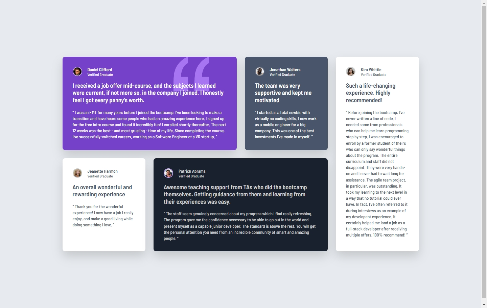
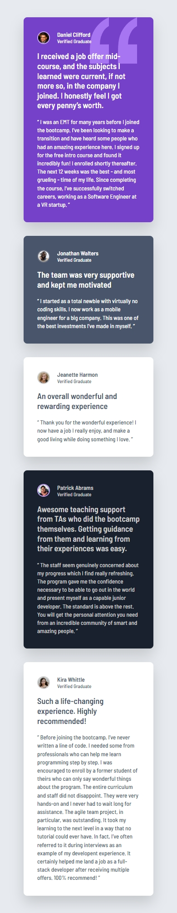

# Frontend Mentor - Testimonials grid section solution

This is a solution to the [Testimonials grid section challenge on Frontend Mentor](https://www.frontendmentor.io/challenges/testimonials-grid-section-Nnw6J7Un7). Frontend Mentor challenges help you improve your coding skills by building realistic projects. 

## Table of contents

- [Overview](#overview)
  - [The challenge](#the-challenge)
  - [Screenshot](#screenshot)
  - [Links](#links)
- [My process](#my-process)
  - [Built with](#built-with)
  - [What I learned](#what-i-learned)
  - [Continued development](#continued-development)
  - [Useful resources](#useful-resources)
  - [AI Collaboration](#ai-collaboration)
- [Author](#author)
- [Acknowledgments](#acknowledgments)


## Overview

### The challenge

Users should be able to:

- View the optimal layout for the site depending on their device's screen size


### Screenshot

DESKTOP DESIGN





MOBILE DESIGN





### Links

- Solution URL: [solution URL here](https://github.com/CasteLeonardo/testimonials-grid-section-main)
- Live Site URL: [live site URL here](https://llano-testimonials-grid-section.netlify.app/)


## My process

### Built with

- Semantic HTML5 markup
- CSS custom properties
- Flexbox
- CSS Grid
- CSS background images
- Mobile-first workflow
- Responsive design with media queries


### What I learned

This project gave me more practice with CSS Grid, especially when creating layouts where different testimonials need to occupy specific columns and rows.

One of the main things I learned in this project was how to use CSS background images to add decorative elements without adding unnecessary markup to the HTML.

I practiced using `background-image`, `background-repeat`, and `background-position` to place the quotation pattern on Daniel's testimonial.

For example:

```css
.testimonial--daniel {
    background-image: url("../images/bg-pattern-quotation.svg");
    background-repeat: no-repeat;
    background-position: 80% 0;
}
```

I also continued practicing responsive layouts by combining Flexbox and CSS Grid. Flexbox was useful for organizing the content inside each testimonial, while CSS Grid was used to create the overall desktop layout.


### Continued development

I want to continue improving my CSS skills, especially with:

- Creating more complex layouts with CSS Grid
- Understanding when to choose Grid or Flexbox
- Improving responsive designs across different screen sizes
- Creating cleaner and more maintainable CSS
- Getting more comfortable with advanced CSS selectors and media queries


### Useful resources

- [Frontend Mentor](https://www.frontendmentor.io/home) - The challenge and design reference used for this project.
- [MDN Web Docs](https://developer.mozilla.org/en-US/) - Useful documentation for HTML and CSS concepts.
- [CSS Grid Garden](https://cssgridgarden.com/#es) - Useful game for practicing grid.


### AI Collaboration

I used ChatGPT as a development assistant throughout the project.

I mainly used it to:

- Discuss possible approaches to CSS styling and hover interactions.
- Get feedback on naming conventions and code organization.
- Improve the project documentation and README.
- Discuss Git commit organization and commit messages.

The implementation and final decisions were made by me. AI was used as a tool for guidance, feedback, and brainstorming rather than as a replacement for writing and understanding the code.


## Author

- Website - [Leonardo Castellanos Portafolio](https://llanoportafolio.netlify.app/)
- Frontend Mentor - [@CasteLeonardo](https://www.frontendmentor.io/profile/CasteLeonardo)
- GitHub - [@CasteLeonardo](https://github.com/CasteLeonardo)
- Linkedin - [Leonardo Castellanos Rivera](https://www.linkedin.com/in/leonardo-castellanos-rivera/)


## Acknowledgments

Thanks to Frontend Mentor for providing the challenge and design reference used to build this project.

This project was completed independently as part of my continued practice with front-end development.